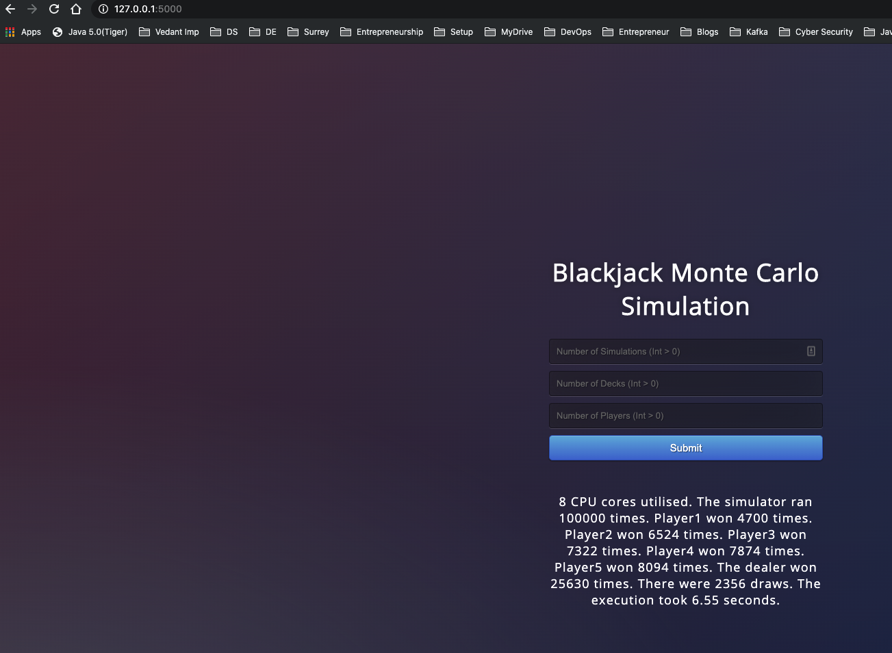

# Multi Player BlackJack Game

## Assumptions

I have given a shot for multi player version as well. In addition to the rules provided, following assumptions were made:

- Win/Lose score set to 21.
- 2 cards are taken by dealer and player first and then player takes all its turn followed by dealer.
- Each player's score is compared to the dealer per hand and per hand a dealer can win multiple times against multiple players but a player can win only once.

## How to run

2 ways to run:

1. From the `multi_player` directory running the `main.py` file

This will ask you for 3 inputs - number of simulations, decks and players.

```shell
python main.py
```

Example:

```shell
 blackjack_gamesys/multi_player  python main.py          
Enter number of simulations (int > 0): 
100000
Enter number of decks (int > 0): 
5
Enter number of players (int > 0): 
5

=============== Results ================

    8 CPU cores utilised.
    The simulator ran 100000 times.
    Player1 won 4690 times. Player2 won 6525 times. Player3 won 7350 times. Player4 won 7822 times. Player5 won 7990 times. 
    The dealer won 25728 times.
    There were 2395 draws.
    The execution took 6.59 seconds.
    
==========================================
```

2. From webapp using flask UI

```shell
python flaskApp.py
```

After running the above command go to the browser http://127.0.0.1:5000/ and enter the details for number of simulations and decks and press Submit. Results would be displayed at the bottom.

Example:

```shell
 blackjack_gamesys/multi_player  python3 flaskApp.py
 * Serving Flask app "flaskApp" (lazy loading)
 * Environment: production
   WARNING: This is a development server. Do not use it in a production deployment.
   Use a production WSGI server instead.
 * Debug mode: on
 * Running on http://127.0.0.1:5000/ (Press CTRL+C to quit)
 * Restarting with stat
 * Debugger is active!
 * Debugger PIN: 450-253-813


```



**NOTE:** `Performance`, `Multi players` and `multiple pack of cards` considerations are taken care of in this work.

## Future Improvements

- Have a way to incorporate default pack of cards based on number of players so that the cards do not get over in the middle of the game. (If insufficient number provided while running)
