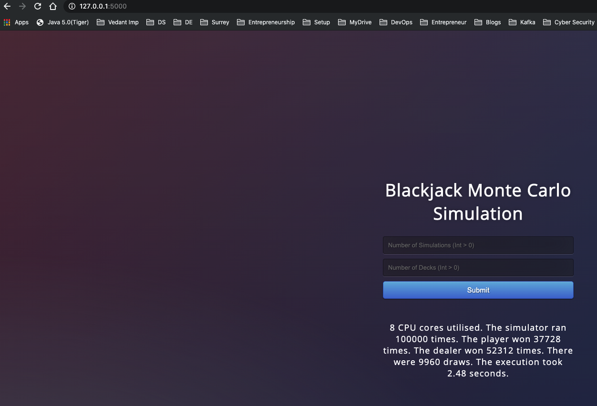

# Single Player BlackJack Game

## Assumptions

In addition to the rules provided, following assumptions were made:

- Win/Lose score set to 21.
- 2 cards are taken by dealer and player first and then player takes all its turn followed by dealer.

## How to run

2 ways to run:

1. From the `single_player` directory running the `main.py` file

This will ask you for 2 inputs - number of simulations and decks

```shell
python main.py
```

Example:

```shell
blackjack_gamesys/single_player  python main.py
Enter number of simulations (int > 0): 
100000
Enter number of decks (int > 0): 
3

=============== Results ================

    8 CPU cores utilised.
    The simulator ran 100000 times.
    The player won 37689 times.
    The dealer won 52446 times.
    There were 9865 draws.
    The execution took 3.6 seconds.
    
==========================================
```

2. From webapp using flask UI

```shell
python flaskApp.py
```

After running the above command go to the browser http://127.0.0.1:5000/ and enter the details for number of simulations and decks and press Submit. Results would be displayed at the bottom.

Example:

```shell
 blackjack_gamesys/single_player  python flaskApp.py             
 * Serving Flask app "flaskApp" (lazy loading)
 * Environment: production
   WARNING: This is a development server. Do not use it in a production deployment.
   Use a production WSGI server instead.
 * Debug mode: on
 * Running on http://127.0.0.1:5000/ (Press CTRL+C to quit)
 * Restarting with stat
 * Debugger is active!
 * Debugger PIN: 450-253-813

```



## Tests

Tests are included in the `test_single.py` file which can be run:

```shell
 blackjack_gamesys/single_player  python test_single.py -v
test_deck (__main__.TestSinglePlayer) ... ok
test_deck_0 (__main__.TestSinglePlayer) ... ok
test_deck_2 (__main__.TestSinglePlayer) ... ok
test_deck_return_type (__main__.TestSinglePlayer) ... ok
test_hand_value (__main__.TestSinglePlayer) ... ok
test_hand_value_type (__main__.TestSinglePlayer) ... ok
test_simulator_result (__main__.TestSinglePlayer) ... ok
test_simulator_result_type (__main__.TestSinglePlayer) ... ok
test_simulator_return_value_type (__main__.TestSinglePlayer) ... ok

----------------------------------------------------------------------
Ran 9 tests in 0.028s

OK
```

**NOTE:** `Performance` and `multiple pack of cards` considerations are taken care of in this work.
